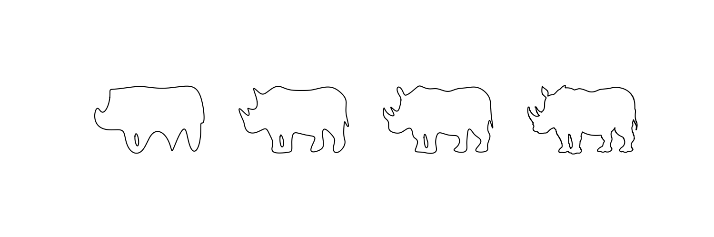

# fourier-animals

A small playful application to go from an image of a rhino via boundary segmentation to an artsy finite order fourier series approximation of the animal. Made for Laura, because rhinos are cute. Inspired by [John von Neumann's famous elephant](https://en.wikipedia.org/wiki/Von_Neumann%27s_elephant).

